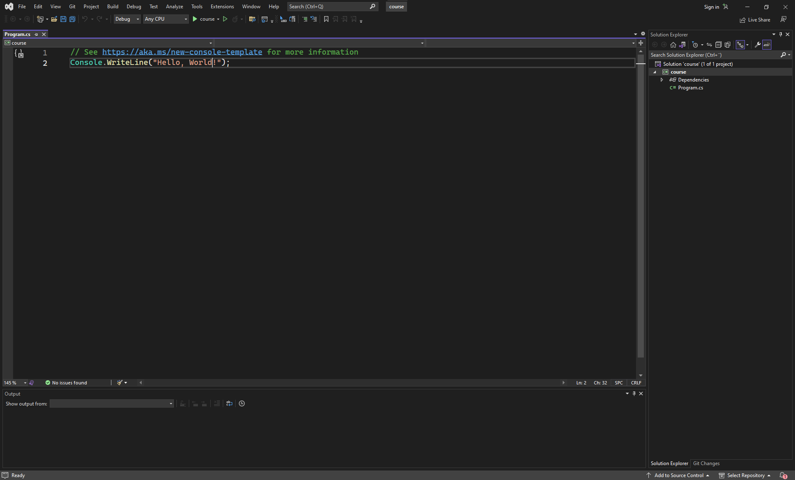

## Introduktion til programmering

&nbsp;

#### Installation af udviklings værktøjer

Vi starter med at sætte et udviklings miljø op:

Start med at download [Visual Studio](https://visualstudio.microsoft.com/)

Vælg .NET desktop development og klik installer

Når installationen er færdig, så lav et nyt "Console App" projekt

#### FAQ

##### Hvad er programmering?

Meget simpelt sagt, så er programmering et værktøj til at løse problemer

&nbsp;

##### Hvilket sprog burde man vælge?

Der er ikke et direkte forkert valg, men nogen sprog er "bedre" til bestemte ting

I dette forløb bruger vi C# da det er et high-level sprog med fokus på vigtige ting som data typer

&nbsp;

#### Introduktion

Da vi arbejder med C#, vil jeg anbefale at læse [dokumentation fra Microsoft](https://learn.microsoft.com/en-us/dotnet/csharp/)

Åbn dit "Console App" projekt, hvis du ikke har lavet noget ændringer, så burde det at se sådan her ud:

Vi gennemgår hurtigt nogen data typer og efter gennemgår vi nogen af de introduktioner lavet af Microsoft

[Hello World](https://learn.microsoft.com/en-us/dotnet/csharp/tour-of-csharp/tutorials/hello-world?tutorial-step=1)

[Numbers in C#](https://learn.microsoft.com/en-us/dotnet/csharp/tour-of-csharp/tutorials/numbers-in-csharp?tutorial-step=1)

[Branches and loops](https://learn.microsoft.com/en-us/dotnet/csharp/tour-of-csharp/tutorials/branches-and-loops?tutorial-step=1)

[Data collections](https://learn.microsoft.com/en-us/dotnet/csharp/tour-of-csharp/tutorials/list-collection?tutorial-step=1)
