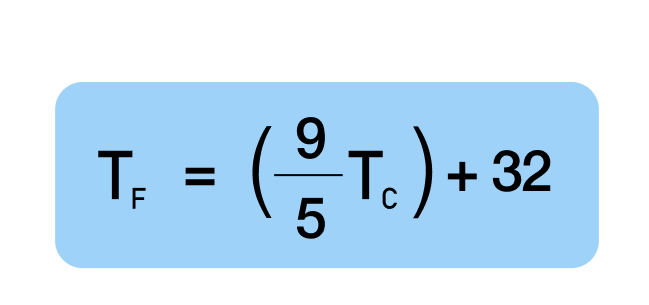

## Opgave 1

I denne opgave skal du konvetere Celsius til Fahrenheit og vise resultatet i konsolen

Eksempel:
20C -> 68F

Hvis du har brug for hjælp kan du søge på internettet eller spørge om hjælp
